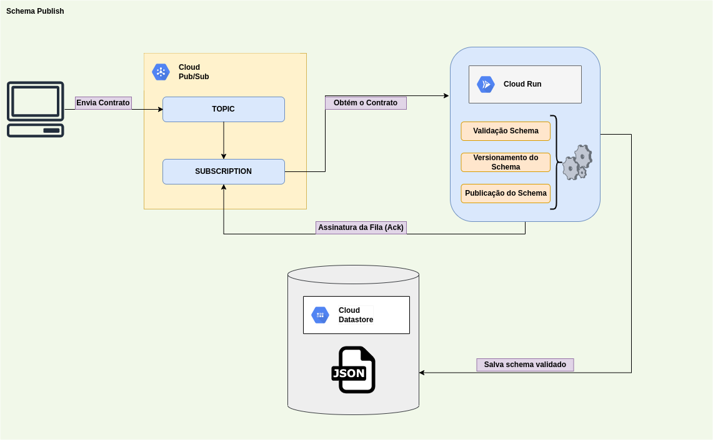

# SCHEMA PUBLISH

- Cloud Run
- Pub/Sub
- Datastore

## Image



## Commands

```sh
export GOOGLE_CLOUD_PROJECT=google-cloud-personal
export GOOGLE_CLOUD_PROJECT_NUMBER=11112222233333
export GOOGLE_REGION=us-east1

export TOPIC_NAME=schema-publish-pub
export TOPIC_SUBSCRIBE=schema-publish-subs
```

```sh
gcloud iam service-accounts create cloud-run-pubsub-invoker --display-name "Cloud Run Pub/Sub Invoker" --project=$GOOGLE_CLOUD_PROJECT

gcloud projects add-iam-policy-binding $GOOGLE_CLOUD_PROJECT \
     --member=serviceAccount:service-$GOOGLE_CLOUD_PROJECT_NUMBER@gcp-sa-pubsub.iam.gserviceaccount.com --role=roles/iam.serviceAccountTokenCreator --project=$GOOGLE_CLOUD_PROJECT
```

```sh
gcloud pubsub topics create $TOPIC_NAME --project=$GOOGLE_CLOUD_PROJECT 
```

```sh
gcloud builds submit --tag gcr.io/$GOOGLE_CLOUD_PROJECT/schema-publish:alpha --project=$GOOGLE_CLOUD_PROJECT 

gcloud beta run deploy schema-publish --image gcr.io/$GOOGLE_CLOUD_PROJECT/schema-publish:alpha \
     --no-allow-unauthenticated \
     --ingress=internal \
     --region=$GOOGLE_REGION \
     --project=$GOOGLE_CLOUD_PROJECT \
     --execution-environment=gen2

gcloud run services list --project=$GOOGLE_CLOUD_PROJECT

gcloud run services add-iam-policy-binding schema-publish \
     --member=serviceAccount:cloud-run-pubsub-invoker@$GOOGLE_CLOUD_PROJECT.iam.gserviceaccount.com \
     --role=roles/run.invoker --project=$GOOGLE_CLOUD_PROJECT --region=$GOOGLE_REGION
```

```sh
gcloud pubsub subscriptions create $TOPIC_SUBSCRIBE --topic $TOPIC_NAME \
   --push-endpoint=https://schema-publish-cthivfpkeq-ue.a.run.app \
   --push-auth-service-account=cloud-run-pubsub-invoker@$GOOGLE_CLOUD_PROJECT.iam.gserviceaccount.com \
   --project=$GOOGLE_CLOUD_PROJECT


gcloud pubsub topics publish $TOPIC_NAME --message "{\"teste\": \"teste\"}" --project=$GOOGLE_CLOUD_PROJECT

gcloud pubsub topics publish $TOPIC_NAME --message "$(cat misc/schema_template_01.json | jq -c)" --project=$GOOGLE_CLOUD_PROJECT
gcloud pubsub topics publish $TOPIC_NAME --message "$(cat misc/schema_template_02.json | jq -c)" --project=$GOOGLE_CLOUD_PROJECT
```

```sh
gcloud run services delete schema-publish --region=$GOOGLE_REGION --project=$GOOGLE_CLOUD_PROJECT
gcloud pubsub subscriptions delete $TOPIC_SUBSCRIBE --project=$GOOGLE_CLOUD_PROJECT
gcloud pubsub topics delete $TOPIC_NAME --project=$GOOGLE_CLOUD_PROJECT 
```

## REF

- https://developers.google.com/chat/how-tos/pub-sub
- https://medium.com/jj-innovative-results/how-to-create-a-simple-hangouts-chat-bot-in-python-ce758270acc7
- https://medium.com/google-cloud/google-cloud-run-or-how-to-run-your-static-website-in-5-minutes-and-much-more-dbe8f2804395
- https://codelabs.developers.google.com/codelabs/cloud-run-deploy/index.html?index=..%2F..index&hl=pt-PT#0
- https://www.digitalocean.com/community/tutorials/how-to-use-web-forms-in-a-flask-application
- https://stackoverflow.com/questions/11556958/sending-data-from-html-form-to-a-python-script-in-flask